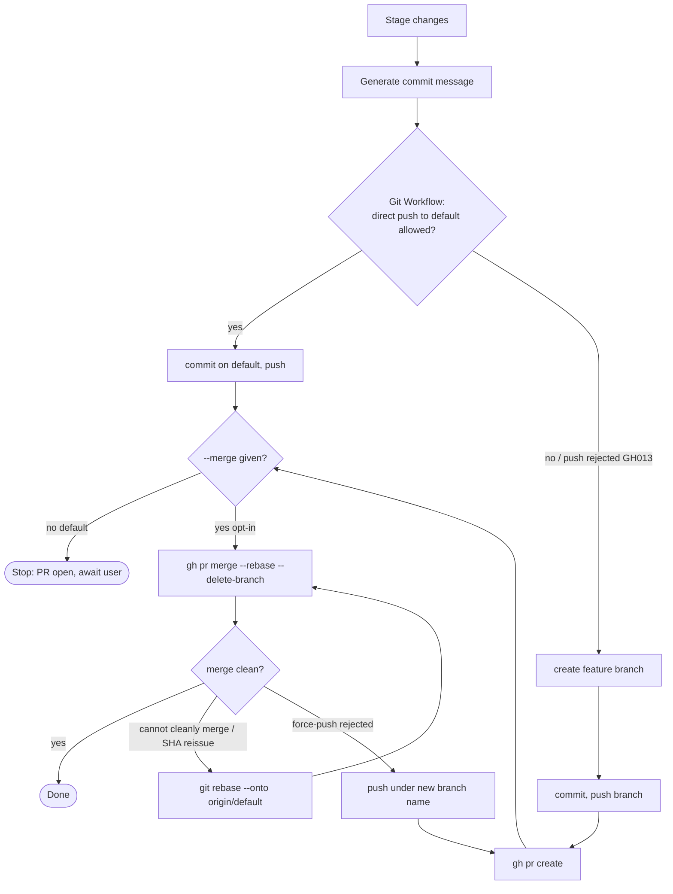

# Ship

Take the current change from working tree to pull request — and optionally
to merge — adapting to the repository's branch-protection rules.

**Merge is gated by default.** `/ship` stops at an open PR (a reversible
proposal). Merging to a protected default branch is an outward-facing,
effectively-irreversible release action, so it requires explicit opt-in
(`--merge`, or a CLAUDE.md `## Escalation Overrides` demote). This mirrors
the project escalation framework (ARCHITECTURE.md §A) and the user's
batch-execution preference (external effects stay confirmation-gated).

Conversely, the **pre-merge steps (commit / branch / push / PR create) are
reversible and run without per-step confirmation** once `/ship` is invoked —
the git ceremony (commit? → push? → PR?) is bundled into one action
(ARCHITECTURE.md §A 進行確認の原則).

Failure-recovery recipes (SHA reissue, force-push rejection, stale local
main) are in [references/git-recovery.md](references/git-recovery.md).

---

## Commands

```
/ship                # commit → branch → push → PR (stop at open PR)  [default]
/ship --pr-only      # same as default (explicit form)
/ship --merge        # the above, then merge (opt-in, protected-branch aware)
/ship my-branch      # use an explicit branch name instead of an inferred one
```

---

## Flow

The control flow branches on branch protection and the merge opt-in. The
diagram is the map; the executable detail is in the steps below.



---

## Step 1: Determine the git workflow

Resolve how this repo delivers changes, in priority order:

1. CLAUDE.md `## Git Workflow` — when present, read the default branch,
   whether direct push is allowed, and the merge strategy (`rebase` /
   `squash` / `merge`).
2. Otherwise **detect**: read the current branch and remote; assume PR
   flow on the default branch unless told otherwise. Never hardcode a
   project's protection rules — treat a rejected push as the signal
   (Step 4).

---

## Step 2: Stage and describe

1. `git status --short` and `git diff --stat` to scope the change.
2. Build a commit message: a concise imperative subject, and a body only
   when the change needs rationale. End with the standard Claude Code
   co-author trailer (current form:
   `Co-Authored-By: Claude Opus 4.8 (1M context) <noreply@anthropic.com>`).
3. If nothing is staged and the tree is clean, report "nothing to ship"
   and stop.

---

## Step 3: Branch

- If the user passed a branch name, use it.
- Else if direct push to the default branch is allowed (Step 1), commit
  there.
- Else create a feature branch with a short, kebab-case, change-derived
  name (e.g. `ship/<topic>`). **Never commit straight onto a protected
  default branch** — it will be rejected at push and waste a round-trip.

---

## Step 4: Commit and push

1. Commit.
2. `git push -u origin <branch>`.
3. **Push rejection is a protection signal, not an error to swallow.**
   - `GH013 ... Changes must be made through a pull request` while pushing
     to the default branch → you committed on the default branch; move the
     commit to a feature branch ([references/git-recovery.md](references/git-recovery.md))
     and push that.
   - Non-fast-forward on an existing branch → see force-push recovery in
     [references/git-recovery.md](references/git-recovery.md).

---

## Step 5: Pull request

1. `gh pr create --base <default> --head <branch>` with:
   - Title = the commit subject.
   - Body = a short summary, the `git diff --stat`, and any verification
     results available in context (gate / review status). End with the
     `🤖 Generated with [Claude Code](https://claude.com/claude-code)`
     trailer.
2. Report the PR URL.

---

## Step 6: Merge (only with `--merge`)

Default (`--pr-only`): **stop here** and report the open PR for the user
to merge.

With `--merge`:

1. `gh pr merge <N> --<strategy> --delete-branch` (strategy from Step 1,
   default `--rebase` on linear-history repos).
2. Failure handling (full recipes in
   [references/git-recovery.md](references/git-recovery.md)):
   - "merge commit cannot be cleanly created" after another PR rebase-merged
     → the base SHAs were reissued; `git rebase --onto origin/<default>
     <old-base> <branch>` and retry.
   - Force-push rejected when realigning a branch → push under a **new**
     branch name, open a fresh PR, close the old one.

---

## Constraints

- Merge defaults to gated; `--merge` is the only in-skill path to merge,
  and even then it stops and escalates (Tier 1) if the repo requires
  reviewers that are unmet.
- Steps 1–5 (commit through PR create) are reversible and proceed without
  per-step confirmation once the change scope is approved; only merge
  (Step 6) and destructive recovery (force-push, history rewrite) pause
  (ARCHITECTURE.md §A 進行確認の原則).
- `git reset --hard` and `git push --force <protected>` are blocked by
  `hooks/pre-bash-safety.sh`; the recovery recipes avoid both
  ([references/git-recovery.md](references/git-recovery.md)).
- Protection rules are detected, not hardcoded — the same skill works on
  an unprotected repo (direct push) and a protected one (PR flow).
- This skill delivers existing changes; it does not edit code. Pair it
  with `impl-orchestrator` (which produces the change) or run it standalone.
