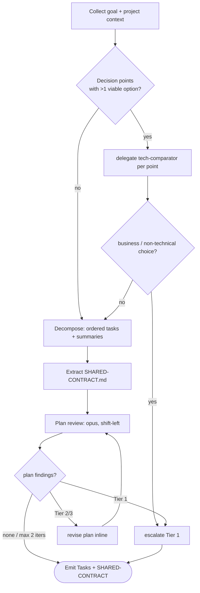

# Task planner (goal-driven front end)

Turn a goal into an ordered task plan with a shared contract, reviewed at
plan time. This is the cheap place to catch bad approaches — a plan-level
defect costs far less than the same defect found after the code is built.

This skill **plans**; it does not write product code (that is
`impl-orchestrator`) and does not write formal specs (that is `design-phase`,
which in the goal-driven flow runs *after* implementation in `--reverse`
mode). Its two artifacts are the **task list** (into PIPELINE-STATE.md) and
the **shared contract** (SHARED-CONTRACT.md).

Detail references:
- [references/templates.md](references/templates.md) — SHARED-CONTRACT.md format, Tasks table, output report
- [references/plan-review.md](references/plan-review.md) — plan-review sub-agent prompt and plan-finding shape

---

## Why a shared contract (read first)

The goal-driven flow trades `design-phase`'s up-front cross-spec audit for
just-in-time per-task planning. The one thing that audit gave us — **cross-
component consistency** — must not be lost, or the pipeline regresses to the
boundary-mismatch bugs it was built to prevent (PLAN.md). The
**SHARED-CONTRACT.md** is the single up-front design artifact that holds the
cross-task interfaces, shared types, API signatures, and DB schema. Every
task is built against it; plan-review and (later) boundary-test check tasks
against it. It is the crown-jewel safeguard, not optional.

---

## Flow

---

## Step 1: Collect goal and context

- **Goal**: the "Plan summary"/goal of `PIPELINE-STATE.md` if running inside
  a pipeline; otherwise the conversation; otherwise ask.
- **Project context** from CLAUDE.md: `## Tech Stack` (constrains tech
  selection), `## Critical Constraints`, `## Component Mapping`. Scan
  existing code when present so the plan aligns with reality.

## Step 2: Tech selection

Identify genuine decision points (datastore, framework, protocol, sync/async,
…). For each point with **more than one viable option**, delegate
`tech-comparator` (Agent) with the candidates, axes, and CLAUDE.md
constraints; take its ranked recommendation.

- Single obvious option (constraint-forced or stack-fixed) → record it, skip
  the comparator.
- Comparator defers, or the choice depends on business/schedule/team → **Tier
  1 escalation** (intent-judgment, ARCHITECTURE.md §A). Do not guess.

## Step 3: Decompose into ordered tasks

Break the goal into large-grained tasks, each with a one-paragraph summary
and explicit dependencies. Order by dependency (foundation → domain →
persistence → API → UI, adapted to the goal). Keep tasks vertically sliceable
so each can run through `impl-orchestrator` independently. Table format:
[references/templates.md](references/templates.md).

## Step 4: Extract the shared contract

Write `SHARED-CONTRACT.md` (format in
[references/templates.md](references/templates.md)): shared types, cross-task
API signatures, data schema, and invariants — with each entry's owning task
and consumers. This is the only artifact every task must conform to.

## Step 5: Plan review (shift-left)

Spawn an opus plan-reviewer (Agent) per
[references/plan-review.md](references/plan-review.md). It checks the plan for
approach soundness, simpler alternatives, risk, missing requirements, and —
critically — **each task against SHARED-CONTRACT.md** (the cross-task audit,
pulled forward to plan time). It emits plan-findings.

Classify each finding via ARCHITECTURE.md §A (apply CLAUDE.md `## Escalation
Overrides` first):

- **Tier 2/3** → revise the plan / contract inline, then re-review.
- **Tier 1** → escalate (approach change, scope, missing requirement that
  needs the user).

Re-review after revisions, **max 2 iterations**; a third round of substantive
findings means the goal itself is underspecified → escalate.

> Plan-review is additive shift-left. It does **not** replace the mechanical
> verification gates in `impl-orchestrator` (build/type/test/boundary) — those
> still run later, before code review (ARCHITECTURE.md §8).

## Step 6: Emit and hand off

1. Write the Tasks section into `PIPELINE-STATE.md` (or create it) and link
   `SHARED-CONTRACT.md`. Layout: [references/templates.md](references/templates.md);
   canonical state format: ARCHITECTURE.md §B.
2. Push any Tier 1 items to the escalation queue and present them.
3. Hand off to `impl-orchestrator` (goal mode): tasks are built in dependency
   order, each against the shared contract.

---

## Output format

Final report renders: the tech decisions (with the deciding axis), the
ordered task list, the shared-contract summary (counts of types / APIs /
schema / invariants), the auto-revised plan-findings, and the escalated
findings. Full template: [references/templates.md](references/templates.md).

---

## Constraints

- SHARED-CONTRACT.md is mandatory, not optional — it is the consistency
  safeguard that replaces design-phase's cross-spec audit (§Why above).
- Tech choices that hinge on non-technical judgement escalate (Tier 1); the
  comparator handles only technical comparison.
- Plan-review is shift-left and additive; it never substitutes for the
  impl-orchestrator verification gates.
- This skill defers formal specs. Generate DESIGN/*.md after implementation
  via `design-phase --reverse` only when documentation is required.
- Plan-findings use the dedicated shape in
  [references/plan-review.md](references/plan-review.md), not
  finding.schema.json (which is the impl-phase contract); only the §A Tier
  framework is shared.
